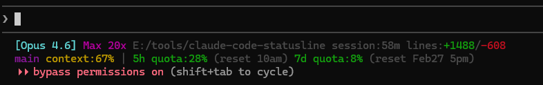
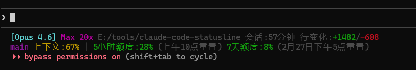
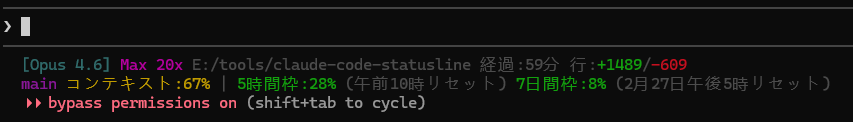

# claude-code-statusline

A Claude Code statusline that shows your **real remaining quota** — by querying the Anthropic API directly.

[中文](#中文说明) | English

## Screenshots







## What you get

Your Claude Code terminal gets a live status bar like this:

```
[Opus 4.6] Pro ~/my-project session:12m lines:+156/-23
main dirty:3 ↑1 context:23% | 5h quota:10% (reset 10am) 7d quota:6% (reset Feb27 5pm)
```

**Line 1** — Who you are and what you're doing:

| What you see | What it means |
|---|---|
| `[Opus 4.6]` | Current model |
| `Pro` | Your plan (Pro / Max 5x / Max 20x / API / Bedrock) |
| `~/my-project` | Working directory |
| `session:12m` | How long this session has been running |
| `lines:+156/-23` | Lines of code added / removed |

**Line 2** — Your repo, context, and quota:

| What you see | What it means |
|---|---|
| `main` | Git branch |
| `dirty:3` | 3 files with uncommitted changes |
| `↑1` | 1 commit ahead of remote |
| `context:23%` | How much of the context window is used |
| `5h quota:10%` | 10% of your 5-hour rate limit used |
| `7d quota:6%` | 6% of your 7-day rate limit used |
| `(reset 10am)` | When the quota resets |

## 9 languages supported

The statusline auto-detects your system language, or you can set `CCSL_LANG`:

**English** (`en`)
```
[Opus 4.6] Pro ~/my-project session:12m lines:+156/-23
main dirty:3 ↑1 context:23% | 5h quota:10% (reset 10am) 7d quota:6% (reset Feb27 5pm)
```

**中文** (`zh`)
```
[Opus 4.6] Pro ~/my-project 会话:12分钟 行变化:+156/-23
main 修改:3 ↑1 上下文:23% | 5小时额度:10%(上午10点重置) 7天额度:6%(2月27日下午5点重置)
```

**日本語** (`ja`)
```
[Opus 4.6] Pro ~/my-project 経過:12分 行:+156/-23
main 変更:3 ↑1 コンテキスト:23% | 5時間枠:10%(午前10時リセット) 7日間枠:6%(2月27日午後5時リセット)
```

**한국어** (`ko`)
```
[Opus 4.6] Pro ~/my-project 세션:12분 줄:+156/-23
main 변경:3 ↑1 컨텍스트:23% | 5시간:10%(오전10시 리셋) 7일:6%(2월27일오후5시 리셋)
```

**Français** (`fr`)
```
[Opus 4.6] Pro ~/my-project session:12min lignes:+156/-23
main modif:3 ↑1 contexte:23% | quota 5h:10% (réinit 10h) quota 7j:6% (réinit 27 fév 17h)
```

**Deutsch** (`de`)
```
[Opus 4.6] Pro ~/my-project Sitzung:12Min Zeilen:+156/-23
main geändert:3 ↑1 Kontext:23% | 5h-Limit:10% (Reset 10:00) 7d-Limit:6% (Reset 27. Feb 17:00)
```

**Español** (`es`)
```
[Opus 4.6] Pro ~/my-project sesión:12min líneas:+156/-23
main modif:3 ↑1 contexto:23% | cuota 5h:10% (reinicio 10h) cuota 7d:6% (reinicio 27 feb 17h)
```

**Português** (`pt`)
```
[Opus 4.6] Pro ~/my-project sessão:12min linhas:+156/-23
main modif:3 ↑1 contexto:23% | cota 5h:10% (reinício 10h) cota 7d:6% (reinício 27 fev 17h)
```

**Русский** (`ru`)
```
[Opus 4.6] Pro ~/my-project сессия:12мин строк:+156/-23
main изменено:3 ↑1 контекст:23% | лимит 5ч:10% (сброс 10:00) лимит 7д:6% (сброс 27 фев 17:00)
```

## Compact mode

Single-line layout for smaller terminals:

```
[Opus 4.6] Pro my-project main dirty:3 context:23% session:12m | 5h quota:10% 7d quota:6%
```

Set `CCSL_LAYOUT=compact` or add `"layout": "compact"` to config file.

## API Key users

If you use an API key instead of OAuth login, the quota section is hidden (API keys don't have 5h/7d limits):

```
[Opus 4.6] API ~/my-project session:12m lines:+156/-23
main context:23%
```

## Install

### Plugin install (recommended)

```bash
claude plugin install https://github.com/fjlmcm/claude-code-statusline
```

Done. The statusline appears automatically on next session.

### npm install

```bash
npm install -g @fjlmcm/claude-code-statusline
ccsl-install   # configure statusline in Claude Code
```

### Manual install

```bash
git clone https://github.com/fjlmcm/claude-code-statusline.git
cd claude-code-statusline
node ccsl-install.js
```

Restart Claude Code to see the statusline.

## Uninstall

```bash
# Plugin:
claude plugin uninstall claude-code-statusline

# Manual:
node ccsl-uninstall.js
```

## Configuration

Create `~/.claude/statusline-config.json`:

```json
{
  "layout": "expanded",
  "cache_ttl": 60,
  "lang": "en"
}
```

Or use environment variables (higher priority):

| Variable | What it does | Default |
|---|---|---|
| `CCSL_LAYOUT` | `expanded` (2 lines) or `compact` (1 line) | `expanded` |
| `CCSL_CACHE_TTL` | How often to refresh quota data (seconds) | `60` |
| `CCSL_LANG` | Language: `en` `zh` `ja` `ko` `fr` `de` `es` `pt` `ru` | auto-detect |
| `CCSL_DEBUG` | Set to `1` to enable debug logging to `~/.claude/statusline-debug.log` | off |

## Debugging

If something isn't working, enable debug logging:

```bash
export CCSL_DEBUG=1
```

All errors (including previously silent failures) are logged to `~/.claude/statusline-debug.log`. Include this file when reporting bugs.

## How it works

1. Claude Code runs the statusline script every time the terminal refreshes
2. The script reads session info (model, context, git, etc.) from stdin
3. Quota data is fetched from the Anthropic API in the background — never slows down Claude Code
4. Everything is displayed with proper colors and non-breaking spaces

## Requirements

- Claude Code CLI
- OAuth login for quota display (API key users get everything except quota)
- Node.js (already included with Claude Code)

## License

MIT

---

# 中文说明

显示**真实剩余额度**的 Claude Code 状态行插件 —— 直接查询 Anthropic API 获取实时数据。

## 截图


## 你会看到什么

```
[Opus 4.6] Pro ~/my-project 会话:12分钟 行变化:+156/-23
main 修改:3 ↑1 上下文:23% | 5小时额度:10%(上午10点重置) 7天额度:6%(2月27日下午5点重置)
```

**第一行** —— 你是谁、在干什么：

| 你看到的 | 含义 |
|---|---|
| `[Opus 4.6]` | 当前使用的模型 |
| `Pro` | 你的订阅计划（Pro / Max 5x / Max 20x / API / Bedrock） |
| `~/my-project` | 当前工作目录 |
| `会话:12分钟` | 这个会话持续了多久 |
| `行变化:+156/-23` | 新增/删除了多少行代码 |

**第二行** —— 仓库状态、上下文、额度：

| 你看到的 | 含义 |
|---|---|
| `main` | 当前 Git 分支 |
| `修改:3` | 有 3 个文件未提交 |
| `↑1` | 比远程仓库领先 1 个提交 |
| `上下文:23%` | 上下文窗口已用多少 |
| `5小时额度:10%` | 5 小时滑动窗口内已使用 10% 的限额 |
| `7天额度:6%` | 7 天滑动窗口内已使用 6% 的限额 |
| `(上午10点重置)` | 额度什么时候恢复 |

## 安装

### 插件安装（推荐）

```bash
claude plugin install https://github.com/fjlmcm/claude-code-statusline
```

装完就行，下次启动自动生效。

### npm 安装

```bash
npm install -g @fjlmcm/claude-code-statusline
ccsl-install
```

### 手动安装

```bash
git clone https://github.com/fjlmcm/claude-code-statusline.git
cd claude-code-statusline
node ccsl-install.js
```

重启 Claude Code 即可看到状态行。

## 卸载

```bash
# 插件方式：
claude plugin uninstall claude-code-statusline

# 手动方式：
node ccsl-uninstall.js
```

## 配置

创建 `~/.claude/statusline-config.json`：

```json
{
  "layout": "expanded",
  "cache_ttl": 60,
  "lang": "zh"
}
```

或者用环境变量（优先级更高）：

| 变量 | 作用 | 默认值 |
|---|---|---|
| `CCSL_LAYOUT` | `expanded`（两行）或 `compact`（一行） | `expanded` |
| `CCSL_CACHE_TTL` | 额度数据刷新间隔（秒） | `60` |
| `CCSL_LANG` | 语言：`en` `zh` `ja` `ko` `fr` `de` `es` `pt` `ru` | 自动检测 |
| `CCSL_DEBUG` | 设为 `1` 启用调试日志，写入 `~/.claude/statusline-debug.log` | 关闭 |

## 调试

如果遇到问题，启用调试日志：

```bash
export CCSL_DEBUG=1
```

所有错误（包括之前静默失败的）都会记录到 `~/.claude/statusline-debug.log`。提交 bug 报告时请附上此文件。

## 工作原理

1. Claude Code 每次刷新终端时运行状态行脚本
2. 脚本从标准输入读取会话信息（模型、上下文、Git 等）
3. 额度数据在后台从 Anthropic API 获取 —— 不会拖慢 Claude Code
4. 所有内容用合适的颜色和不间断空格显示

## 要求

- Claude Code CLI
- OAuth 登录才能显示额度（API Key 用户除额度外其他功能正常）
- Node.js（Claude Code 自带）
